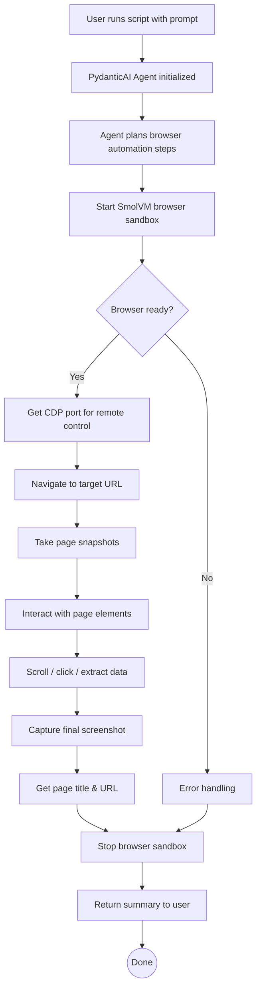

# PydanticAI Agent Browser Example

Drive a SmolVM browser from PydanticAI using the `agent-browser` CLI.

## Flow Diagram



## What It Does

1. **Input** — User provides a prompt (e.g., "open amazon.com and tell me trending products")
2. **Orchestration** — PydanticAI agent uses `run_host_bash` tool to execute SmolVM and agent-browser CLI commands
3. **Browser lifecycle** — Start isolated microVM browser → control via CDP → stop when done
4. **Output** — Screenshot, page summary, title, and URL returned to user

## Prerequisites

```bash
pip install smolvm pydantic-ai
brew install agent-browser  # or npm install -g agent-browser
agent-browser install
export OPENAI_API_KEY=...
smolvm doctor
```

## Usage

```bash
# Run the built-in demo (opens BBC News)
python examples/agent_tools/pydanticai_agent_browser.py

# Custom prompt
python examples/agent_tools/pydanticai_agent_browser.py --input "Open example.com"
```
